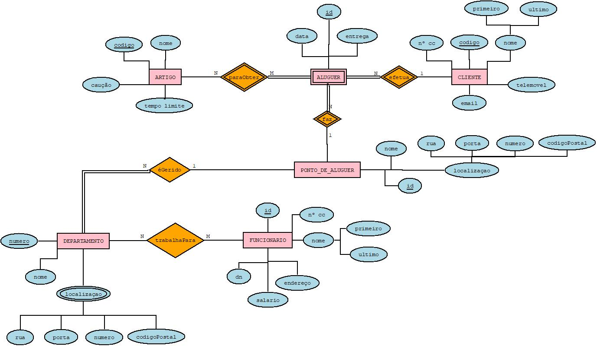

# C2 : Esquema conceptual

## Modelo E/A

### Entidades:

ARTIGO (_codigo, nome, localizaçao, cauçao, tempo limite, quantidade) 

CLIENTE (_codigo, n CC, telemovel, email, nome (primeiro, ultimo))

DEPARTAMENTO (_numero, nome, *localizaçao (cidade, rua, numero))

FUNCIONARIO (_id, n CC, nome (primeiro, ultimo), sexo, endereço, salario, dn)

ALUGUER (data, entrega)

PONTO_DE_ALUGUER (nome, _id, localização (rua, cidade, numero))

### Associações:

trabalhaPara (FUNCIONARIO, DEPARTAMENTO) N:M  P/T

efetua (CLIENTE, ALUGUER) 1:N  P/P

paraObter (ALUGUER, ARTIGO) M:N  P/T

faz (PONTO_DE_ALUGUER, ALUGUER) 1:N  P/P

éGerido (PONTO_DE_ALUGUER, DEPARTAMENTO) 1:N  P/T

Diagrama E/A 

## Regras de negócio adicionais (Restrições)
Alguns dos artigos não tem qualquer caução ou limite de horas de aluguer.

O gerente deve fazer uma análise mensalmente relativamente aos alugueres efetuados no respetivo mês. 

---
[< Previous](rebd01.md) | [^ Main](https://github.com/tcm-sibd-g07/SIBD07/) | [Next >](rebd03.md)
:--- | :---: | ---: 
